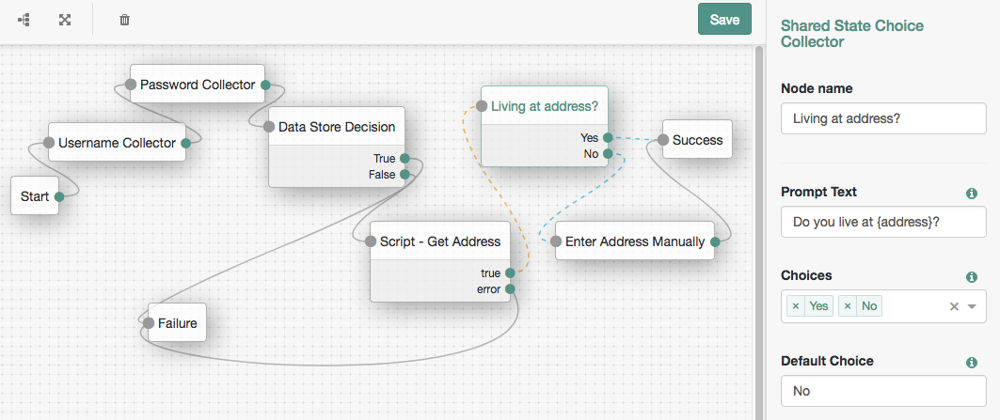

<!--
 * The contents of this file are subject to the terms of the Common Development and
 * Distribution License (the License). You may not use this file except in compliance with the
 * License.
 *
 * You can obtain a copy of the License at legal/CDDLv1.0.txt. See the License for the
 * specific language governing permission and limitations under the License.
 *
 * When distributing Covered Software, include this CDDL Header Notice in each file and include
 * the License file at legal/CDDLv1.0.txt. If applicable, add the following below the CDDL
 * Header, with the fields enclosed by brackets [] replaced by your own identifying
 * information: "Portions copyright [year] [name of copyright owner]".
 *
 * Copyright 2018 David Adams david.adams@forgerock.com
-->
# Shared State Choice Collector Node

A simple authentication node for ForgeRock's [Identity Platform][forgerock_platform] 5.5 and above. This node presents a prompt to the user containing (optional) information from shared state, asking for their choice of a configured list of options.

# Installation

Copy the .jar file from the ../target directory into the ../web-container/webapps/openam/WEB-INF/lib directory where AM is deployed.  Restart the web container to pick up the new node.  The node will then appear in the authentication trees components palette.

# Usage

Deploy the node, and enter the following:
- Node name: Pick a useful name describing what the node does
- Prompt Text: Enter the to be displayed to the user
    - If required, variables to be included from shared state can be referenced using curly brackets
    - For example given a variable 'address' in shared state you could set 'Do you live at {address}?'
    - If the variables you are referencing are nested, for example a variable 'customer' that has a property 'address', use '{customer.address}'
- Choices: Enter a list of choices that the user can pick. These will form the choices presented to the user, and the outcomes for the node
- Default choice: Enter one of the choices (case sensitive) that will be the default if the user does not specify a choice

For example to prompt the user to ask if the address already obtained earlier in the tree that is now in shared state, is the one they live at, you could do the following:

# Modify/Re-Build

The code in this repository has binary dependencies that live in the ForgeRock maven repository. Maven can be configured to authenticate to this repository by following the following [ForgeRock Knowledge Base Article](https://backstage.forgerock.com/knowledge/kb/article/a74096897).

Edit the necessary SharedStateChoiceCollectorNode.java as appropriate. To rebuild, run "mvn clean install" in the directory containing the pom.xml 

# Disclaimer
The sample code described herein is provided on an "as is" basis, without warranty of any kind, to the fullest extent permitted by law. ForgeRock does not warrant or guarantee the individual success developers may have in implementing the sample code on their development platforms or in production configurations.

ForgeRock does not warrant, guarantee or make any representations regarding the use, results of use, accuracy, timeliness or completeness of any data or information relating to the sample code. ForgeRock disclaims all warranties, expressed or implied, and in particular, disclaims all warranties of merchantability, and warranties related to the code, or any service or software related thereto.

ForgeRock shall not be liable for any direct, indirect or consequential damages or costs of any type arising out of any action taken by you or others related to the sample code.

[forgerock_platform]: https://www.forgerock.com/platform/  
